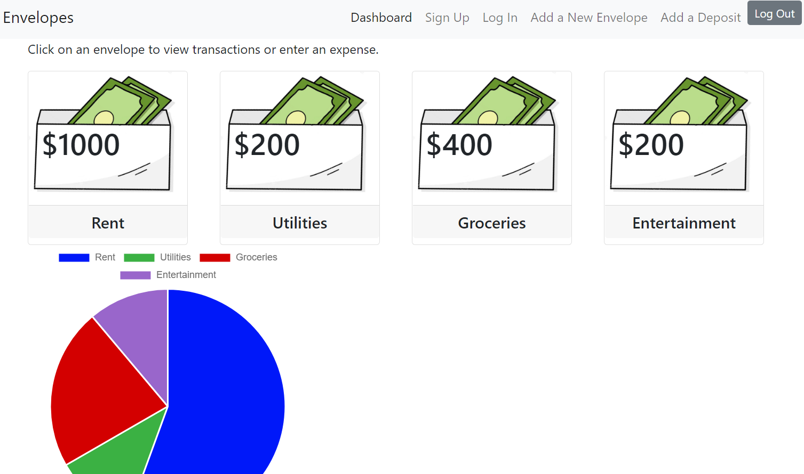

# Envelopes
  
  ## Description
  Simple envelope budgeting app.

  Deployed at [Heroku](https://cash-envelopes.herokuapp.com/).

  See the repo at [GitHub](https://github.com/gerrissgailey/envelopes).

  
  ## Table of Contents
  * [Installation](#installation)
  * [Usage](#usage)
  * [Credits](#credits)
  * [License](#license)
  * [Contributing](#contributing)
  * [Tests](#tests)
  * [Questions](#questions)
  ## Installation
  To install required packages, navigate to the `envelopes` directory and enter `npm i`.
  ## Usage
  To run the application, enter `npm start`.
  ## Credits
  The following resources were used in this project:

  - [Node.js](https://nodejs.org/en/)
  - [Express](https://expressjs.com/)
  - [MongoDB](https://www.mongodb.com/2)
  - [Mongoose](https://mongoosejs.com/)
  - [React](https://reactjs.org/)
  - [Recoil](https://recoiljs.org/)
  - [npm react-chartjs-2](https://www.npmjs.com/package/react-chartjs-2)
  - [Bootstrap](https://getbootstrap.com/)
  ## License
  This project is covered under the MIT license.
  ## Contributing
  Please submit a pull request.
  ## Tests
  Not provided.
  ## Questions
  Feel free to reach out with questions.

[https://www.github.com/gerrissgailey](https://www.github.com/gerrissgailey)

[https://www.github.com/JordonBobo](https://www.github.com/JordonBobo)

[https://www.github.com/danielryangreen](https://www.github.com/danielryangreen)
